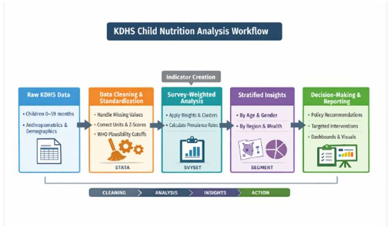

# 🌍 Kenya Child Nutrition Analysis: From Data to Policy Action

[](https://powerbi.microsoft.com/)
[](https://www.stata.com/)
[](https://www.stata.com/)
[](https://dhsprogram.com/)

> **Transforming survey data into actionable nutrition policy recommendations using advanced statistical methods and interactive visualizations**


## 📊 Project Overview

This project analyzes **17,280 children** from the Kenya Demographic and Health Survey (KDHS) to identify critical drivers of child malnutrition and provide evidence-based policy recommendations. By combining **survey-weighted logistic regression**, **geographic analysis**, and **interactive visualizations**, the analysis reveals actionable insights for resource allocation and intervention design.

The analysis covers the three core WHO malnutrition indicators:

| Indicator | Definition | Reflects |
|-----------|-----------|----------|
| **Stunting** | Height-for-Age Z-score (HAZ) < −2 | Chronic malnutrition |
| **Wasting** | Weight-for-Height Z-score (WHZ) < −2 | Acute malnutrition |
| **Underweight** | Weight-for-Age Z-score (WAZ) < −2 | Combined chronic & acute |

---
## 🎯 Objectives

- Clean and standardize real-world DHS survey data using WHO protocols
- Generate nationally representative malnutrition prevalence estimates using survey-weighted analysis
- Identify geographic, demographic, and socioeconomic drivers of child malnutrition
- Produce interactive Power BI dashboards for policy and programmatic decision-making
- Quantify determinants of stunting through multivariate logistic regression
- Translate analytical findings into targeted, evidence-based recommendations for program planners and policymakers

---
## 🔄 Analytical Workflow



> The pipeline moves from raw KDHS survey data through cleaning and standardization in Stata, survey-weighted prevalence estimation, stratified subgroup analysis, and finally to policy-ready dashboards and evidence-based recommendations.
---

## 🗃️ Data Description

**Source:** Kenya Demographic and Health Survey (KDHS)

The dataset includes the following key variables:

| Variable Category | Variables |
|-------------------|-----------|
| **Child Anthropometry** | Height (cm), Weight (kg) |
| **WHO Z-scores** | HAZ (height-for-age), WAZ (weight-for-age), WHZ (weight-for-height), BMIZ |
| **Demographics** | Age in months, sex, date of birth |
| **Household Characteristics** | Wealth index quintile, maternal education level |
| **Survey Design** | Cluster, strata, sample weights |

---

## 📊 Key Findings

### National Prevalence

| Indicator | National Prevalence |
|-----------|-------------------|
| Stunting | ~22% |
| Wasting | ~12% |
| Underweight | ~16% |

---

### Stunting by Region — Top Hotspots

> Regions above the 25% WHO threshold (red dashed line) require priority intervention:

| Region | Stunting Prevalence |
|--------|-------------------|
| **Kilifi** | 36.7% |
| **West Pokot** | 33.8% |
| **Samburu** | 30.3% |
| **Meru** | 25.9% |

---

### Wasting by Region — Top Affected Areas

| Region | Wasting Prevalence |
|--------|--------------------|
| **Wajir** | 22.7% |
| **Turkana** | 22.1% |
| **Marsabit** | 20.5% |

> Wajir, Turkana, and Marsabit reflect the acute food insecurity and recurrent droughts in ASAL (Arid and Semi-Arid Lands) regions.

---

### Stunting by Age Group

Stunting peaks sharply in the **12–23 month** age group (22.7%) — the critical window for complementary feeding — and remains elevated through 35 months, reflecting the "first 1,000 days" vulnerability period.

---

### Sex Disparities

**Male children** (19.6% stunted) are significantly more affected than female children (14.9%), a pattern consistent with global literature on sex-differential growth vulnerability.

---

### Socioeconomic Gradient

Malnutrition decreases consistently with household wealth and maternal education:

- Children in the **poorest households** are nearly **3.5× more likely to be stunted** than those in the richest quintile
- Children of mothers with **no education** show stunting rates more than **2.5× higher** than children of mothers with higher education

---

### Regression Results — Determinants of Stunting

Key findings from the multivariate logistic regression (odds ratios, survey-weighted):

| Factor | Odds Ratio | Interpretation |
|--------|-----------|----------------|
| Female sex | 0.70 (p<0.001) | Girls 30% less likely to be stunted than boys |
| Higher maternal education | 0.64 (p=0.010) | Significantly protective vs. no education |
| Middle wealth quintile | 0.55 (p<0.001) | Substantially lower odds than poorest |
| Richest wealth quintile | 0.29 (p<0.001) | 71% lower odds of stunting |
| Kilifi (vs. reference) | 1.88 (p=0.003) | Significantly elevated stunting risk |
| Wajir (vs. reference) | 0.44 (p<0.001) | Wajir higher wasting but lower stunting |
| Kisumu (vs. reference) | 0.41 (p=0.003) | Significantly lower stunting risk |

> Regional disparities **persist after adjusting for socioeconomic factors**, suggesting structural inequalities beyond poverty.

---

## 🛠️ Technical Skills 
### **Statistical Analysis**
- ✅ Complex survey design handling (stratification, clustering, sampling weights)
- ✅ Multivariate logistic regression with odds ratio interpretation
- ✅ Confounding control and causal inference principles
- ✅ Statistical significance testing and confidence intervals

### **Data Visualization**
- ✅ Interactive Power BI dashboards with drill-through capabilities
- ✅ Geospatial analysis and regional hotspot identification
- ✅ Multi-dimensional data representation (age, gender, education, wealth)
- ✅ Color theory application for accessibility and impact

### **Policy Translation**
- ✅ Converting statistical findings into actionable recommendations
- ✅ Resource allocation frameworks based on evidence
- ✅ Stakeholder communication (technical → executive summaries)
- ✅ ROI analysis and impact projection

---


## 📈 Key Visualizations

### 1. Regional Stunting Hotspot 


**Insight:** Kilifi (36.7%), West Pokot (33.8%), and Samburu (30.3%) require emergency intervention

---

### 2. Age-Specific Vulnerability Patterns


**Insight:** Critical intervention window: 12-47 months (peak malnutrition burden)

---

### 3. Maternal Education Threshold Effect


**Insight:** Only higher education provides protection; primary/secondary have no effect


---

## 💡 Policy Recommendations

### 🎯 **Immediate Actions (0-6 months)**

| Priority | Intervention | Target | Expected Impact |
|----------|-------------|--------|-----------------|
| **Critical** | Emergency therapeutic feeding | Kilifi, West Pokot, Samburu | 50-60% wasting reduction |
| **High** | Mobile health clinics | 4 critical regions | Improved access for 500,000 children |
| **Essential** | Community-based management of acute malnutrition | All red-tier regions | 40% stunting reduction in 24 months |

### 📊 **Resource Allocation Framework**

```
Budget Distribution by Regional Risk Tier:
├── Critical (>30% stunting): 50% of budget → 4 regions
├── High (20-30% stunting): 35% of budget → 8 regions
└── Moderate (<20% stunting): 15% of budget → 4 regions
```

### 🎓 **Long-Term Investments**

1. **Expand girls' higher education** in high-burden regions (15-20 year horizon)
2. **Strengthen WASH infrastructure** in critical counties
3. **Integrate nutrition into secondary curricula** (medium-term)

---

## 📊 Impact Metrics

### **Projected Outcomes** (with recommended interventions)

| Metric | Baseline | 12-Month Target | 24-Month Target |
|--------|----------|----------------|-----------------|
| **National Stunting** | 17.3% | 15.5% | 12.0% |
| **Critical Region Stunting** | 30-37% | 25-30% | 20-25% |
| **Equity Gap** (highest-lowest) | 22.1 points | 18 points | 15 points |
| **Children Prevented from Stunting** | — | ~50,000 | ~120,000 |

### **Cost-Effectiveness**
- Targeted approach: **$45 per child protected** (3-4x better than universal programming)
- ROI: **$16 returned for every $1 invested** (through reduced healthcare costs, improved productivity)

---

## 📬 Contact & Collaboration

**Author:** [Phanice Osoro]  
**Email:** phanice01.ke@gmail.com  
**LinkedIn:** [linkedin.com/in/yourprofile](https://www.linkedin.com/in/phanice-analyst/))  


### Let's Connect!
I'm interested in roles involving:
- 📊 Public health analytics and epidemiology
- 🌍 Development economics and impact evaluation
- 📈 Data science for social impact
- 🏥 Health policy analysis and evidence synthesis

---


**Interested in this work?** ⭐ Star this repository and let's discuss how data-driven insights can transform public health outcomes!

---

<div align="center">

**Built with** 💙 **for evidence-based policy making**

[⬆ Back to Top](#-kenya-child-nutrition-analysis-from-data-to-policy-action)

</div>
